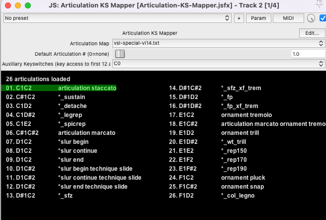
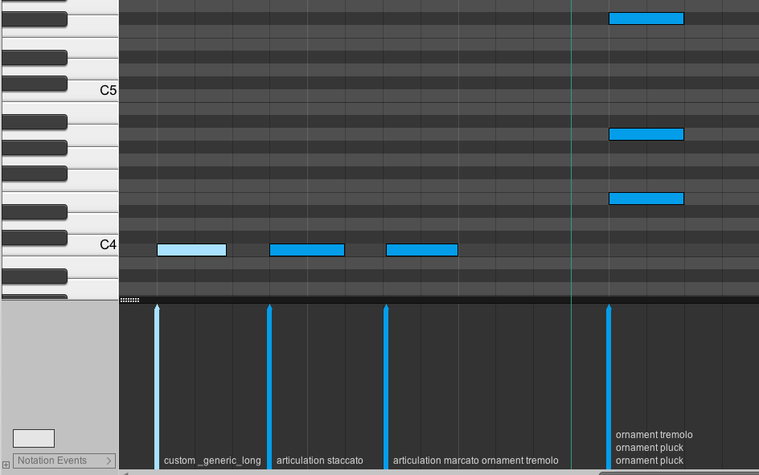

# Articulation Mapper

This JSFX plugin allows you to define articulations which hook into
Reaper's built-in notation features.



## Overview

The file format supports the following elements (or combinations thereof):

- Keyswitch (i.e. note) - e.g `C#1`
- Midi CC e.g `cc20.64` sets CC20 to 64
- UACC/KS (Spitfire Audio 'standard') e.g. `C-1.1` sends C-1 at velocity 1

* Note: UACC/KS is specific to Spitfire, and this plugin only supports keyswitches on a 'C' note 

You can put up to 4 of these elements together in a sequence.  Elements in the
sequence are sent in the order specified; all notes are set to ON, then all
notes are set to OFF. Any intervening Midi CC elements are sent when the notes
are being turned ON.

NOTE: C4 is middle C (midi #60)

## Installation

- Copy the [JSFX](Articulation-KS-Mapper.jsfx) to your `REAPER/Effects` folder.
- Copy the [articulation maps folder](articulation-maps) into the `REAPER/Data/articulation-maps` folder (you will need to create this)

## Usage

- Select the articulation map you want to use
- Set a default articulation for when a note has no notation associated with it
- Add notation to your notes!

## Examples (not specific to any library):

```
; Any lines that don't match an articulation specification are ignored so you
; can put free-form comments in the file, like this comment.  Semicolons are
; used at the start of comments in the example just to make it clearer

; Articulations are searched in order for a match - the first matching notation
; will be used, and the corresponding sequence will be sent.

; NB you don't actually need to put this articulation on long notes, instead
; you can just set an articulation to be a default when no notation has 
; been put on the note (see below)

C1 custom _generic_long; Everything after a semicolon is ignored

; NOTE: you'll need to define custom notations such as that above whenever
; there isn't a corresponding notation 'articulation' or 'ornament' etc.

; A note's notation must match exactly the string specified

C#1 articulation staccato
D1 articulation marcato
D#1 ornament tremolo

; This next one is a multi-key switch; D1 and D#1 will be pressed then released
; before the actual note is sent; this example might work well for libraries
; from Spitfire that allow you to layer articulations.
; 
; It will also work for VSL, where the Synchron player uses 'dimensions'
; comprising multiple keys to get to a single articulation.

D1D#1 articulation marcato ornament tremolo

; This uses a MIDI CC value hard-coded to set the amount of tremolo:

D1D#1cc20.64 articulation marcato ornament tremolo

E1 ornament pluck; Pizzicato
```

